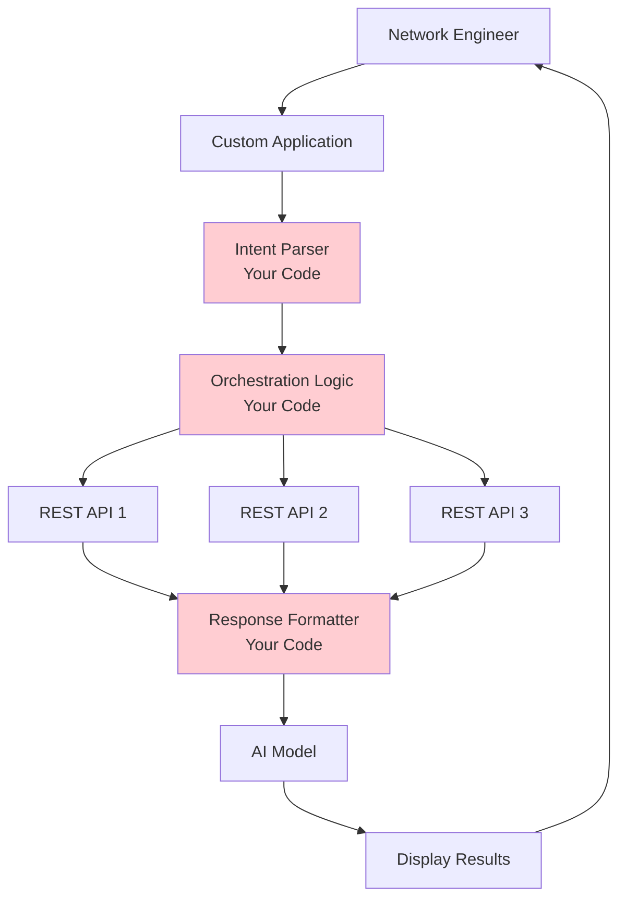
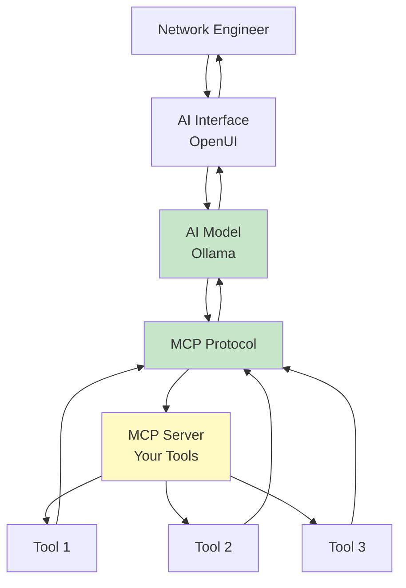

# MCP vs REST: Visual Comparison

A side-by-side comparison to understand why MCP is powerful for AI-assisted operations.

## Architecture Comparison

### Traditional REST API Architecture



**You write code for:**
- Parsing user intent
- Deciding which APIs to call
- Formatting responses
- Orchestrating multiple calls
- Error handling for each API
- Maintaining integration code

---

### MCP Architecture



**You write code for:**
- Tool implementation only
- MCP handles everything else

---

## Code Comparison

### Example Task: "Check if google.com is reachable and if ports 80 and 443 are open"

### Traditional REST Approach

```python
import requests
import re

def handle_user_request(user_input):
    """You write all this orchestration code"""

    # 1. Parse user intent (your code)
    if "reachable" in user_input or "ping" in user_input:
        hostname = extract_hostname(user_input)  # You write this

        # 2. Call REST API (your code)
        try:
            response = requests.get(f"http://api.example.com/ping/{hostname}")
            ping_result = response.json()
        except Exception as e:
            return f"Error: {e}"

    # 3. Check if user wants port info (your code)
    if "port" in user_input:
        ports = extract_ports(user_input)  # You write this

        port_results = []
        for port in ports:
            # 4. Call another REST API (your code)
            try:
                response = requests.get(
                    f"http://api.example.com/ports/{hostname}/{port}"
                )
                port_results.append(response.json())
            except Exception as e:
                return f"Error checking port {port}: {e}"

    # 5. Format everything for AI (your code)
    formatted = format_for_ai(ping_result, port_results)  # You write this

    # 6. Send to AI (your code)
    ai_response = send_to_ai_model(formatted)  # You write this

    return ai_response

def extract_hostname(text):
    """You write this parser"""
    # Complex regex or NLP to find hostname
    pass

def extract_ports(text):
    """You write this parser"""
    # Parse which ports user wants
    pass

def format_for_ai(ping, ports):
    """You write this formatter"""
    # Structure data for AI consumption
    pass
```

**Lines of code:** ~100+ (with error handling, logging, etc.)
**Maintenance:** High - every new API needs integration code
**Flexibility:** Low - hard-coded logic

---

### MCP Approach

```python
from fastmcp import FastMCP

mcp = FastMCP("Network Tools")

@mcp.tool()
def ping(hostname: str) -> str:
    """Check if a host is reachable"""
    # Just implement the tool
    result = subprocess.run(["ping", "-c", "4", hostname], capture_output=True)
    return result.stdout.decode()

@mcp.tool()
def check_port(hostname: str, port: int) -> str:
    """Check if a TCP port is open"""
    # Just implement the tool
    sock = socket.socket()
    sock.settimeout(3)
    result = sock.connect_ex((hostname, port))
    return "Open" if result == 0 else "Closed"

if __name__ == "__main__":
    mcp.run()
```

**Lines of code:** ~30 (with error handling)
**Maintenance:** Low - AI handles orchestration
**Flexibility:** High - AI adapts to user needs

**AI handles automatically:**
- Understanding user intent
- Deciding which tools to call
- Calling tools in correct order
- Interpreting results
- Formatting response

---

## Real-World Scenario Comparison

### Scenario: User asks "Is our customer portal down? Check DNS, ping, and web ports"

### REST Approach - What You Build

```python
class NetworkDiagnostics:
    """Complex orchestration you must write"""

    def diagnose_website(self, url):
        results = {}

        # Parse URL
        hostname = self.extract_hostname(url)

        # Check DNS
        try:
            dns_api = f"{self.api_base}/dns/{hostname}"
            results['dns'] = requests.get(dns_api).json()
        except:
            results['dns'] = {'error': 'DNS check failed'}

        # Only ping if DNS worked
        if 'error' not in results['dns']:
            try:
                ping_api = f"{self.api_base}/ping/{hostname}"
                results['ping'] = requests.get(ping_api).json()
            except:
                results['ping'] = {'error': 'Ping failed'}

        # Only check ports if ping worked
        if 'error' not in results['ping']:
            for port in [80, 443]:
                try:
                    port_api = f"{self.api_base}/port/{hostname}/{port}"
                    results[f'port_{port}'] = requests.get(port_api).json()
                except:
                    results[f'port_{port}'] = {'error': f'Port {port} check failed'}

        # Format for AI
        formatted = self.format_diagnostic_results(results)

        # Send to AI for interpretation
        return self.ai_interpret(formatted)

    def format_diagnostic_results(self, results):
        """Convert API responses to AI-friendly format"""
        # 50+ lines of formatting logic
        pass

    def ai_interpret(self, data):
        """Send to AI and get response"""
        # API call to AI service
        pass
```

**Problems:**
- You hardcode the diagnostic logic
- Can't easily adapt to different scenarios
- User must match your expected input format
- Adding new checks requires code changes

---

### MCP Approach - What AI Does

**User:** "Is our customer portal down? Check DNS, ping, and web ports"

**AI's internal reasoning:**
1. "User wants to check if a website is accessible"
2. "I should check DNS first - use dns_lookup tool"
3. "DNS works, now check if host is reachable - use ping tool"
4. "Host is up, check web services - use check_port for 80 and 443"
5. "Interpret results: DNS resolves, host reachable, ports open = site is up"
6. "Respond: The customer portal appears to be functioning normally..."

**Your code:** Just the 3 tools (dns_lookup, ping, check_port)

**AI handles:**
- Understanding complex question
- Choosing correct tools
- Determining order of operations
- Interpreting combined results
- Providing helpful response

---

## Flexibility Comparison

### Adding a New Capability: "Check SSL Certificate Expiration"

### REST Approach

```python
# 1. Add new API endpoint integration
def check_ssl_cert(hostname):
    try:
        response = requests.get(f"{api_base}/ssl/{hostname}")
        return response.json()
    except Exception as e:
        return {'error': str(e)}

# 2. Update intent parser to recognize SSL requests
def parse_user_intent(text):
    # Add new patterns
    if "ssl" in text or "certificate" in text or "https" in text:
        return "check_ssl"
    # ... existing patterns

# 3. Update orchestration logic
def handle_request(user_input):
    intent = parse_user_intent(user_input)

    if intent == "check_ssl":  # New branch
        hostname = extract_hostname(user_input)
        result = check_ssl_cert(hostname)
        formatted = format_ssl_result(result)  # New formatter
        return send_to_ai(formatted)

    # ... existing logic

# 4. Add new formatter
def format_ssl_result(result):
    # Format SSL data for AI
    pass
```

**Total changes:** 4 functions, multiple files
**Testing needed:** All integration points
**Time:** 2-4 hours

---

### MCP Approach

```python
@mcp.tool()
def check_ssl(hostname: str, port: int = 443) -> str:
    """Check SSL certificate expiration and details"""
    # Just implement the tool
    context = ssl.create_default_context()
    with socket.create_connection((hostname, port), timeout=5) as sock:
        with context.wrap_socket(sock, server_hostname=hostname) as ssock:
            cert = ssock.getpeercert()
            expiry = cert['notAfter']
            # Return expiry info
            return f"Certificate expires: {expiry}"
```

**Total changes:** 1 function, 1 file
**Testing needed:** Just the new tool
**Time:** 15-30 minutes

**AI automatically:**
- Understands SSL questions
- Knows when to call check_ssl
- Combines with other tools as needed
- No orchestration code needed

---

## Adaptability Example

### User Variations - Same Intent, Different Phrasing

**REST approach:** Must handle each variation explicitly

```python
# Must cover all these patterns:
patterns = [
    "is google.com up",
    "can you ping google.com",
    "check if google.com is reachable",
    "is google.com responding",
    "google.com status",
    "verify google.com connectivity",
    # ... hundreds more
]
```

**MCP approach:** AI understands naturally

All of these work automatically:
- "is google.com up"
- "can you ping google.com"
- "check if google.com is reachable"
- "is google.com responding"
- "google.com status"
- "verify google.com connectivity"
- "I can't reach google.com, help me diagnose"
- "troubleshoot connection to google.com"
- **Any natural phrasing works!**

---

## Scalability

### Managing 50 Network Tools

### REST Approach

```
Your code:
├── intent_parser.py         (500+ lines, covers all tools)
├── orchestration.py         (1000+ lines, all combinations)
├── api_integrations/
│   ├── tool1.py
│   ├── tool2.py
│   ├── ... (50 files)
├── formatters/
│   ├── format_tool1.py
│   ├── format_tool2.py
│   ├── ... (50 files)
└── tests/
    └── ... (hundreds of integration tests)
```

**Total code:** ~10,000+ lines
**Complexity:** High - must maintain all combinations
**Onboarding:** Weeks to understand codebase

---

### MCP Approach

```
Your code:
└── network_tools.py         (50 tool functions @ 20 lines each)
```

**Total code:** ~1,000 lines
**Complexity:** Low - each tool is independent
**Onboarding:** Hours to understand

---

## Maintenance Burden

### REST: When Requirements Change

**Scenario:** "Now we need to check IPv6 in addition to IPv4"

**Changes needed:**
1. Update ping API integration
2. Update DNS API integration
3. Update port check API integration
4. Update intent parser for IPv6 patterns
5. Update orchestration logic for v4/v6
6. Update all formatters for new data
7. Update AI prompts
8. Test all combinations
9. Update documentation

**Time:** 1-2 days
**Risk:** Breaking existing functionality

---

### MCP: When Requirements Change

**Scenario:** "Now we need to check IPv6 in addition to IPv4"

**Changes needed:**
1. Add `ipv6: bool` parameter to existing tools
2. Update tool implementation

**Time:** 30 minutes
**Risk:** Low - tools are independent

**AI automatically:**
- Understands IPv6 questions
- Knows to pass ipv6=True when needed
- Handles both IPv4 and IPv6 naturally

---

## Summary Table

| Aspect | REST Approach | MCP Approach |
|--------|---------------|--------------|
| **Code You Write** | Intent parsing, orchestration, formatting, integration | Just tool implementation |
| **Lines of Code** | 5,000-10,000+ | 500-1,000 |
| **Flexibility** | Hard-coded logic | AI adapts naturally |
| **Adding Tools** | 2-4 hours + testing | 15-30 minutes |
| **Maintenance** | High - many integration points | Low - independent tools |
| **Natural Language** | Must define patterns | Works automatically |
| **Complex Queries** | Must anticipate combinations | AI figures it out |
| **Learning Curve** | Weeks (complex codebase) | Days (simple tools) |
| **Scalability** | Complexity grows exponentially | Complexity grows linearly |

---

## When to Use Each

### Use REST APIs When:
- You need precise, deterministic control
- The workflow never changes
- You don't need natural language interface
- You're integrating into existing REST-based systems

### Use MCP When:
- You want AI-assisted operations
- Users need natural language interface
- Requirements change frequently
- You want rapid development
- Multiple tools need to work together
- Users are humans (not other programs)

---

## The Real Power: Composition

The true power of MCP isn't just simpler code—it's **intelligent composition**.

**Example: Complex troubleshooting**

**User:** "Our customer portal is slow. Help me diagnose what's wrong. Check latency, DNS response time, port availability, and see if there are any errors in the logs."

**REST Approach:**
- You must write code to handle this specific combination
- Or user must make 4 separate requests
- Results are independent, user correlates manually

**MCP Approach:**
- AI automatically calls: ping, dns_lookup, check_port, read_log_file
- AI correlates results
- AI provides unified analysis
- You wrote zero orchestration code

---

## Conclusion

**REST is great for machine-to-machine.**
**MCP is powerful for human-to-machine with AI.**

For network engineering with AI assistance, MCP provides:
- Faster development
- Better user experience
- Easier maintenance
- Natural language interface
- Intelligent tool composition
- Rapid adaptation to new requirements

**The future of network operations is AI-assisted, and MCP is the bridge.**

---

Return to [Main Lab](README.md) | Try [Network Troubleshooting](scenarios/network-troubleshooting.md)
