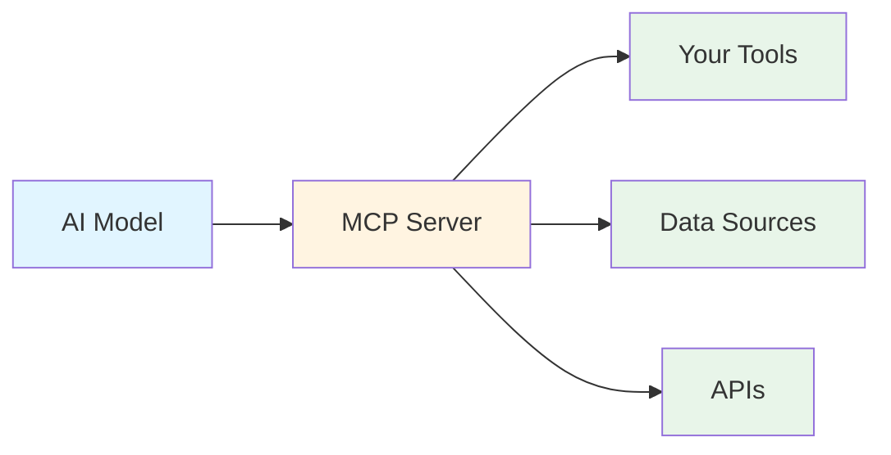
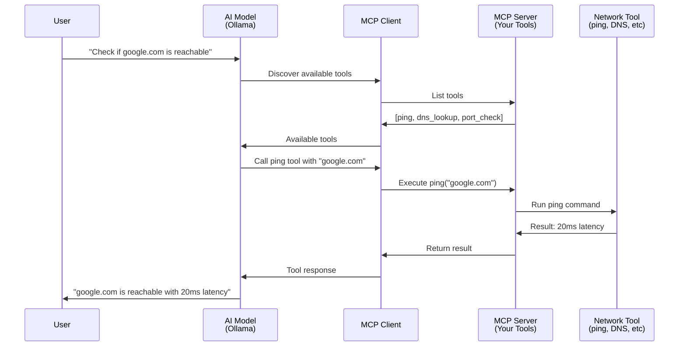
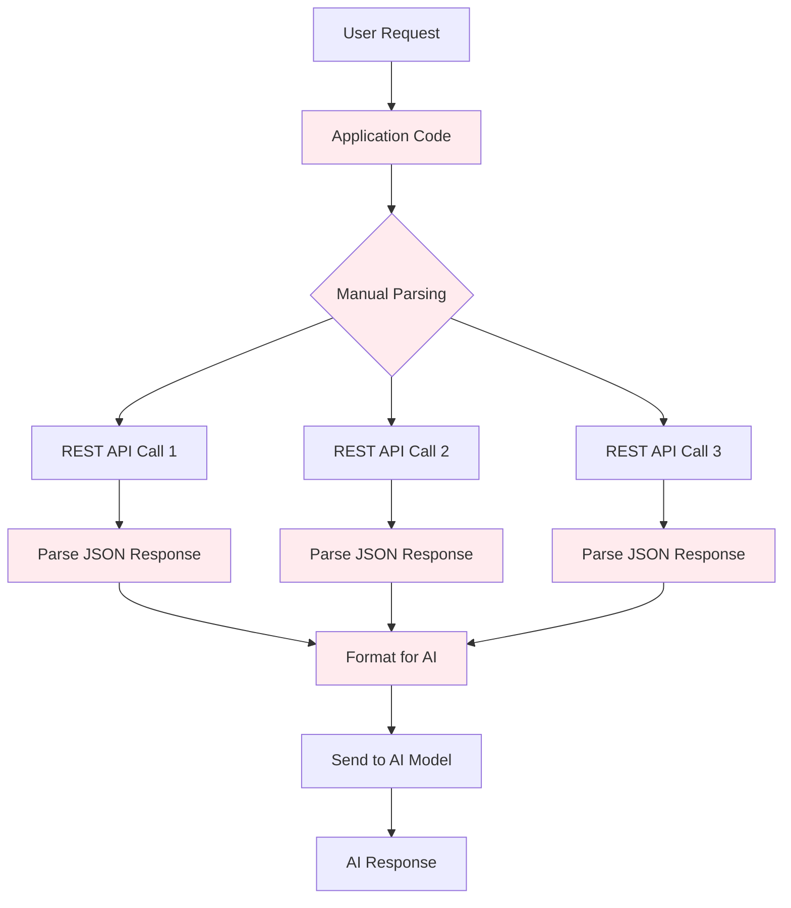
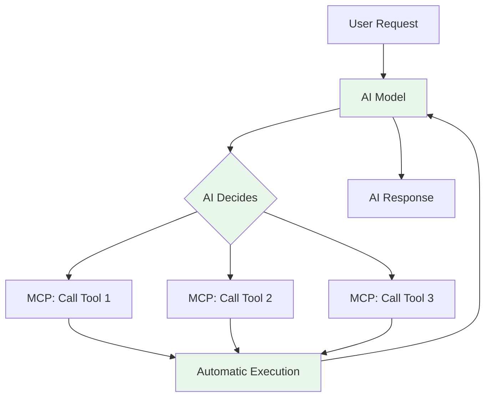
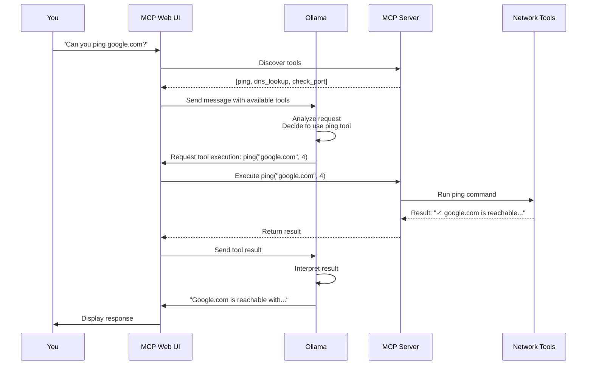

# MCP (Model Context Protocol) Learning Lab

A hands-on introduction to the Model Context Protocol (MCP) with practical network engineering tools and scenarios.

## Table of Contents
- [What You'll Learn](#what-youll-learn)
- [Prerequisites](#prerequisites)
- [Lab Overview](#lab-overview)
- [Understanding MCP](#understanding-mcp)
- [Understanding Ollama](#understanding-ollama)
- [MCP vs Traditional REST APIs](#mcp-vs-traditional-rest-apis)
- [Lab Setup](#lab-setup)
- [Building Your First MCP Tools](#building-your-first-mcp-tools)
- [Testing Your Tools](#testing-your-tools)
- [Next Steps](#next-steps)

## What You'll Learn

By completing this lab, you will:
- Understand what MCP is and why it matters for AI applications
- Learn how to run local LLMs using Ollama
- Build custom MCP tools using FastMCP (Python)
- Create network-focused tools (ping, DNS lookup, port checker)
- See practical advantages of MCP over traditional REST APIs

## Prerequisites

- **Windows 11 with WSL2** installed and configured
- **Basic command line** experience
- **Basic Python** knowledge (reading/understanding code)
- **Network engineering** background (understanding ping, DNS, ports)
- **Docker** (brief installation guide included if needed)

## Lab Overview

This lab takes a progressive approach:

1. **Concepts & Setup** - Understand MCP and Ollama while setting up your environment
2. **First Tools** - Build simple network diagnostic tools with FastMCP
3. **Hands-on Testing** - Use your tools through MCP Web UI
4. **Real-world Scenarios** - Apply your knowledge (separate labs in [scenarios/](scenarios/))
5. **Extension Challenges** - Advanced exercises (see [scenarios/](scenarios/))

---

## Understanding MCP

### What is MCP?

**Model Context Protocol (MCP)** is an open protocol created by Anthropic that standardizes how AI applications (like chatbots or agents) connect to external data sources and tools.

Think of MCP as a universal adapter that allows AI models to:
- **Access data sources** (databases, files, APIs)
- **Execute tools** (run commands, query systems, manipulate data)
- **Maintain context** across conversations

### Why MCP Matters



**Key Benefits:**
- **Standardization** - One protocol for all tool integrations
- **Security** - Controlled access to resources
- **Composability** - Mix and match tools from different sources
- **Discoverability** - AI models can discover available tools automatically

### MCP Architecture



**Components:**
1. **MCP Host** - The application using AI (like MCP Web UI in our lab)
2. **MCP Client** - Connects to and communicates with MCP servers
3. **MCP Server** - Exposes tools and resources to the AI
4. **Tools/Resources** - The actual functionality (your network tools)

---

## Understanding Ollama

### What is Ollama?

**Ollama** is a tool that makes it easy to run large language models (LLMs) locally on your machine.

**Why Use Ollama?**
- **Privacy** - Your data never leaves your machine
- **Cost** - No API fees, unlimited usage
- **Speed** - No network latency for API calls
- **Offline** - Works without internet connection
- **Control** - Choose your model, adjust parameters

**The Granite Models:**
- **granite4** - IBM's open-source LLM optimized for enterprise use
- **granite4:350m** - Smaller variant (350 million parameters) for low-resource systems
- Good balance of performance and resource usage for learning

---

## MCP vs Traditional REST APIs

### Traditional REST API Approach



**REST API Challenges:**
- You write code to parse user intent
- You manually decide which APIs to call
- You parse and format responses for the AI
- Each new tool requires integration code
- The AI can't discover or adapt to new tools

### MCP Approach



**MCP Benefits:**
- AI understands user intent automatically
- AI discovers and calls appropriate tools
- Results automatically flow back to AI
- Adding tools is just configuration
- AI can chain multiple tools intelligently

### Practical Example

**Scenario:** User asks "Is google.com down? Check both ping and DNS"

**With REST APIs:**
```python
# You write this code
def check_website(url):
    # Parse what user wants
    if "ping" in user_request:
        result1 = requests.get(f"http://api.example.com/ping/{url}")
        ping_data = result1.json()

    if "dns" in user_request:
        result2 = requests.get(f"http://api.example.com/dns/{url}")
        dns_data = result2.json()

    # Format for AI
    formatted = f"Ping: {ping_data}, DNS: {dns_data}"

    # Send to AI
    ai_response = call_ai_model(formatted)
```

**With MCP:**
```python
# You write this once
@mcp.tool()
def ping(hostname: str) -> str:
    """Check if a host is reachable"""
    # Implementation
    return result

@mcp.tool()
def dns_lookup(hostname: str) -> str:
    """Resolve DNS for a hostname"""
    # Implementation
    return result

# AI handles everything else automatically
# - Understands user wants both ping and DNS
# - Calls both tools
# - Interprets results
# - Responds to user
```

### Comparison Table

| Aspect | Traditional REST | MCP |
|--------|-----------------|-----|
| **Tool Discovery** | Hardcoded in application | AI discovers automatically |
| **Intent Parsing** | Manual string parsing | AI understands naturally |
| **Orchestration** | You write logic | AI chains tools intelligently |
| **Adding Tools** | Write integration code | Define tool schema |
| **Adaptability** | Fixed workflows | AI adapts to user needs |
| **Development Time** | High (lots of glue code) | Low (define tools, AI handles rest) |
| **Maintenance** | Update every integration | Update tool definitions |

---

## Lab Setup

### Step 1: Verify WSL Environment

**What:** Ensure you're running in WSL2 (Windows Subsystem for Linux).

**Why:** Ollama and Docker work best in a Linux environment. WSL2 provides full Linux kernel compatibility.

```bash
# Verify you're in WSL
uname -a
# Should show: Linux ... Microsoft ... WSL2
```

**Ubuntu Server Note:** If you're running on a native Ubuntu server instead of WSL, the commands are identical. The main difference is Docker may have better performance on native Linux.

### Step 2: Install Docker (If Needed)

**What:** Docker allows us to run containerized applications like MCP Web UI.

**Why:** MCP Web UI provides a user-friendly web interface specifically designed for the Model Context Protocol, allowing you to interact with Ollama models while testing your MCP tools.

**Quick Docker Install (if needed):**

```bash
# Update package list
sudo apt update

# Install Docker
curl -fsSL https://get.docker.com -o get-docker.sh
sudo sh get-docker.sh

# Add your user to docker group (avoid sudo)
sudo usermod -aG docker $USER

# Apply group changes (or logout/login)
newgrp docker

# Verify installation
docker --version
```

**Ubuntu Server Note:** On Ubuntu Server, you may need to ensure the Docker daemon starts on boot:
```bash
sudo systemctl enable docker
sudo systemctl start docker
```

### Step 3: Install Ollama

**What:** Ollama is the runtime that executes LLMs locally.

**Why:** We need a local AI model to demonstrate MCP tool integration without relying on external APIs.

```bash
# Install Ollama
curl -fsSL https://ollama.com/install.sh | sh

# Verify installation
ollama --version
```

**How it works:**
- Ollama runs as a background service
- Listens on `http://localhost:11434` by default
- Manages model downloads and execution
- Provides OpenAI-compatible API

### Step 4: Pull the Granite Model

**What:** Download the IBM Granite 4 language model.

**Why:** Granite4 is a capable open-source model good for learning and testing. The smaller variant works on modest hardware.

**Choose based on your system:**

```bash
# For systems with 8GB+ RAM and decent CPU/GPU
ollama pull granite4

# For low-resource systems (4-8GB RAM)
ollama pull granite4:350m
```

**What's happening:**
- Ollama downloads model weights (can be several GB)
- Caches model locally in `~/.ollama/models`
- First run will take a few minutes
- Subsequent uses are instant

**Verify the model:**
```bash
# List installed models
ollama list

# Test the model
ollama run granite4
# Or for smaller model:
ollama run granite4:350m

# Type a test message, then /bye to exit
```

### Step 5: Install Python and FastMCP

**What:** Set up Python environment and install the FastMCP framework.

**Why:** FastMCP is a Python framework that makes it easy to create MCP servers. It handles all the protocol details, so you focus on building tools.

```bash
# Install Python and pip (if not already installed)
sudo apt update
sudo apt install python3 python3-pip python3-venv -y

# Create a project directory
mkdir -p ~/mcp-lab
cd ~/mcp-lab

# Create a virtual environment
python3 -m venv venv

# Activate virtual environment
source venv/bin/activate

# Install FastMCP
pip install fastmcp

# Verify installation
python -c "import fastmcp; print('FastMCP installed successfully')"
```

**What is FastMCP?**
- Python framework for building MCP servers
- Handles protocol serialization/deserialization
- Provides decorators for easy tool definition
- Automatically generates tool schemas
- Built-in error handling

### Step 6: Set Up MCP Web UI

**What:** MCP Web UI is a web-based interface specifically designed for the Model Context Protocol.

**Why:** Unlike general LLM interfaces, MCP Web UI natively supports MCP servers, allowing seamless integration with your custom tools. It provides a visual way to interact with Ollama while automatically discovering and using your MCP tools.

#### Create MCP Web UI Configuration

**What:** Create a configuration file that tells MCP Web UI how to connect to both Ollama and your MCP server.

**Why:** The config.yaml file defines which LLM provider to use (Ollama) and which MCP servers to load (your network tools).

```bash
# Create config directory
mkdir -p ~/.config/mcpwebui

# Create configuration file
cat > ~/.config/mcpwebui/config.yaml << 'EOF'
port: 8080
logLevel: info

systemPrompt: |
  You are a helpful AI assistant with access to network diagnostic tools.
  When users ask about network connectivity, DNS, or port accessibility,
  use the available tools to provide accurate, real-time information.

llm:
  provider: ollama
  model: granite4:350m
  temperature: 0.7
  maxTokens: 2048

mcpStdIOServers:
  network-tools:
    command: python3
    args:
      - /home/YOUR_USERNAME/mcp-lab/tools/network_tools.py
    description: Network diagnostic tools (ping, DNS, port check)
EOF

# Update the config file with your username
sed -i "s/YOUR_USERNAME/$(whoami)/g" ~/.config/mcpwebui/config.yaml
```

**What this configuration does:**
- `port: 8080` - Web interface will be accessible on port 8080
- `systemPrompt` - Instructions for the AI on how to use the tools
- `llm.provider: ollama` - Use your local Ollama installation
- `llm.model: granite4:350m` - Specifies which model to use
- `mcpStdIOServers` - Defines your network tools MCP server
  - `command` and `args` - How to start your MCP server
  - Points to the network_tools.py script you created

#### Run MCP Web UI Container

**What:** Start the MCP Web UI Docker container with your configuration.

**Why:** Docker provides an isolated, consistent environment. The container will connect to your Ollama instance and automatically load your MCP tools.

```bash
# Run MCP Web UI container
docker run -d \
  -p 8080:8080 \
  --add-host=host.docker.internal:host-gateway \
  --network host \
  -v ~/.config/mcpwebui/config.yaml:/app/config.yaml \
  -v ~/mcp-lab:/home/$(whoami)/mcp-lab \
  --name mcp-web-ui \
  --restart always \
  ghcr.io/megagrindstone/mcp-web-ui:latest
```

**What's happening here:**
- `-d` - Runs in background (detached)
- `-p 8080:8080` - Maps port 8080 in container to port 8080 on your host
- `--add-host=host.docker.internal:host-gateway` - Allows container to reach Ollama on WSL host
- `--network host` - Uses host network for easier access to Ollama
- `-v ~/.config/mcpwebui/config.yaml:/app/config.yaml` - Mounts your config file
- `-v ~/mcp-lab:/home/$(whoami)/mcp-lab` - Mounts your MCP tools directory so the container can access network_tools.py
- `--name mcp-web-ui` - Names the container for easy reference
- `--restart always` - Automatically restart if container stops

**Access MCP Web UI:**
```bash
# Open in your Windows browser:
# http://localhost:8080
```

**Important:** After starting the container, it may take 30-60 seconds for the web interface to become accessible. Be patient!

**WSL Note:** The URL `http://localhost:8080` works from Windows because WSL2 automatically forwards ports. Your Windows browser can access WSL services seamlessly.

**Ubuntu Server Note:** If you're on a remote Ubuntu server, you'll need to:
- Access via `http://<server-ip>:8080`, or
- Set up SSH port forwarding: `ssh -L 8080:localhost:8080 user@server`

**Verify Setup:**
1. Wait 30-60 seconds after starting the container
2. Open http://localhost:8080 in your browser
3. You should see the MCP Web UI interface with a chat window
4. Your Ollama model (granite4:350m) should be automatically configured
5. Try sending a test message: "Hello, what tools do you have access to?"
6. The AI should respond mentioning the ping, DNS lookup, and port check tools

### Step 7: Verify Full Setup

**What:** Quick checklist to ensure everything is working.

**Why:** Better to catch issues now before building tools. This verifies that all components (Ollama, MCP Web UI, Python environment) are properly configured and communicating.

```bash
# 1. Check Ollama is running
curl http://localhost:11434/api/version
# Should return version info like: {"version":"0.x.x"}

# 2. Check MCP Web UI container is running
docker ps | grep mcp-web-ui
# Should show mcp-web-ui container with status "Up"

# 3. Check Python environment
source ~/mcp-lab/venv/bin/activate
python -c "import fastmcp; print('Ready to build!')"
# Should print: Ready to build!

# 4. Verify MCP Web UI can access Ollama
docker logs mcp-web-ui --tail 20
# Should see startup logs without errors about Ollama connection
```

**If you see any errors, check the [Troubleshooting Guide](TROUBLESHOOTING.md).**

---

## Building Your First MCP Tools

Now the fun part! We'll create network diagnostic tools that the AI can use.

### Project Structure

```bash
cd ~/mcp-lab
mkdir tools
cd tools
```

Create this structure:
```
~/mcp-lab/tools/
├── network_tools.py    # Our MCP server with tools
├── config.json         # MCP server configuration
└── requirements.txt    # Python dependencies
```

### Create Requirements File

**What:** Define Python dependencies for our tools.

**Why:** Our network tools need additional libraries for DNS lookup and network operations.

```bash
cat > requirements.txt << 'EOF'
fastmcp
dnspython
EOF

# Install dependencies
pip install -r requirements.txt
```

### Build the Network Tools Server

**What:** Create an MCP server with three network diagnostic tools.

**Why:** These tools demonstrate practical MCP usage for network engineers - ping for connectivity, DNS lookup for name resolution, and port checking for service availability.

Create [tools/network_tools.py](tools/network_tools.py):

```python
#!/usr/bin/env python3
"""
MCP Server with Network Diagnostic Tools
Provides ping, DNS lookup, and port checking capabilities
"""

import subprocess
import socket
import dns.resolver
from typing import Optional
from fastmcp import FastMCP

# Initialize MCP server
mcp = FastMCP("Network Tools")

@mcp.tool()
def ping(hostname: str, count: int = 4) -> str:
    """
    Check if a host is reachable using ICMP ping.

    Args:
        hostname: The hostname or IP address to ping
        count: Number of ping packets to send (default: 4)

    Returns:
        Ping results including latency and packet loss
    """
    try:
        # Run ping command
        result = subprocess.run(
            ["ping", "-c", str(count), hostname],
            capture_output=True,
            text=True,
            timeout=10
        )

        if result.returncode == 0:
            # Parse output for summary
            lines = result.stdout.split('\n')
            summary = [l for l in lines if 'packet loss' in l or 'rtt' in l or 'min/avg/max' in l]
            return f"✓ {hostname} is reachable\n" + "\n".join(summary)
        else:
            return f"✗ {hostname} is not reachable\n{result.stdout}"

    except subprocess.TimeoutExpired:
        return f"✗ Ping to {hostname} timed out"
    except Exception as e:
        return f"✗ Error pinging {hostname}: {str(e)}"


@mcp.tool()
def dns_lookup(hostname: str, record_type: str = "A") -> str:
    """
    Perform DNS lookup for a hostname.

    Args:
        hostname: The hostname to resolve
        record_type: DNS record type (A, AAAA, MX, NS, TXT, CNAME)

    Returns:
        DNS resolution results
    """
    try:
        resolver = dns.resolver.Resolver()

        # Query DNS
        answers = resolver.resolve(hostname, record_type)

        results = [f"DNS lookup for {hostname} ({record_type} records):"]
        for rdata in answers:
            results.append(f"  - {rdata.to_text()}")

        return "\n".join(results)

    except dns.resolver.NXDOMAIN:
        return f"✗ {hostname} does not exist (NXDOMAIN)"
    except dns.resolver.NoAnswer:
        return f"✗ No {record_type} records found for {hostname}"
    except dns.resolver.Timeout:
        return f"✗ DNS query timed out for {hostname}"
    except Exception as e:
        return f"✗ Error resolving {hostname}: {str(e)}"


@mcp.tool()
def check_port(hostname: str, port: int, timeout: float = 3.0) -> str:
    """
    Check if a TCP port is open on a host.

    Args:
        hostname: The hostname or IP address to check
        port: The TCP port number to check
        timeout: Connection timeout in seconds (default: 3.0)

    Returns:
        Port status and connection result
    """
    try:
        # Create socket
        sock = socket.socket(socket.AF_INET, socket.SOCK_STREAM)
        sock.settimeout(timeout)

        # Try to connect
        result = sock.connect_ex((hostname, port))
        sock.close()

        if result == 0:
            # Try to identify common services
            service = socket.getservbyport(port, 'tcp') if port < 1024 else "unknown"
            return f"✓ Port {port} is OPEN on {hostname} (service: {service})"
        else:
            return f"✗ Port {port} is CLOSED or filtered on {hostname}"

    except socket.gaierror:
        return f"✗ Could not resolve hostname: {hostname}"
    except socket.timeout:
        return f"✗ Connection to {hostname}:{port} timed out"
    except Exception as e:
        return f"✗ Error checking port: {str(e)}"


if __name__ == "__main__":
    # Run the MCP server
    mcp.run()
```

**Understanding the Code:**

1. **FastMCP Initialization:**
   ```python
   mcp = FastMCP("Network Tools")
   ```
   - Creates an MCP server named "Network Tools"
   - This name appears when tools are discovered

2. **Tool Decorator:**
   ```python
   @mcp.tool()
   def ping(hostname: str, count: int = 4) -> str:
   ```
   - `@mcp.tool()` registers the function as an MCP tool
   - Type hints help the AI understand parameters
   - Docstrings are critical - the AI reads them to understand what the tool does

3. **Error Handling:**
   - Each tool has comprehensive try/except blocks
   - Returns user-friendly error messages
   - Important for AI to understand what went wrong

### Test Your MCP Server

**What:** Run the server standalone to verify it works.

**Why:** Easier to debug issues before integrating with MCP Web UI. Running standalone confirms the tools work correctly.

```bash
# Make the script executable
chmod +x network_tools.py

# Run the server (Ctrl+C to stop)
python3 network_tools.py
```

You should see output like:
```
╭──────────────────────────────────────────────────────────────────────────────╮
│                                                                              │
│                         ▄▀▀ ▄▀█ █▀▀ ▀█▀ █▀▄▀█ █▀▀ █▀█                        │
│                         █▀  █▀█ ▄▄█  █  █ ▀ █ █▄▄ █▀▀                        │
│                                                                              │
│                                FastMCP 2.13.1                                │
│                                                                              │
│                    🖥  Server name: Network Tools                             │
│                    📦 Transport:   STDIO                                     │
╰──────────────────────────────────────────────────────────────────────────────╯

INFO     Starting MCP server 'Network Tools' with transport 'stdio'
```

**What this means:**
- The server is running successfully and waiting for MCP client connections
- It will appear to "hang" - this is normal! The server is listening for JSON-RPC messages via stdin
- Your three tools (ping, dns_lookup, check_port) are registered and ready
- Press Ctrl+C to stop the server when you're done testing

---

## Testing Your Tools

### Access MCP Web UI

**What:** Open the MCP Web UI interface in your browser.

**Why:** MCP Web UI is already configured with your tools from Step 6. Now you can interact with the AI and see your MCP tools in action.

1. **Access MCP Web UI:**
   - Open your browser to http://localhost:8080
   - You should see a clean chat interface
   - The granite4:350m model is already configured
   - Your network tools are automatically loaded and ready to use

2. **Verify Tools are Loaded:**
   - Send this message: "What tools do you have access to?"
   - The AI should respond mentioning: ping, DNS lookup (dns_lookup), and port check (check_port) tools
   - If the AI doesn't mention the tools, check the container logs: `docker logs mcp-web-ui`

### Try Your Tools!

**Example Prompts to Test:**

1. **Simple Ping:**
   ```
   Can you ping google.com and tell me if it's reachable?
   ```

2. **DNS Lookup:**
   ```
   What are the DNS A records for github.com?
   ```

3. **Port Check:**
   ```
   Is port 443 open on google.com?
   ```

4. **Combined:**
   ```
   Check if microsoft.com is up by both pinging it and checking if port 80 is open
   ```

5. **Network Troubleshooting:**
   ```
   I can't reach example.com. Can you help me diagnose the issue?
   Check DNS resolution, ping, and common ports (80, 443)
   ```

**What to Observe:**

- The AI understands your natural language request
- The AI automatically chooses which tools to use
- The AI can chain multiple tools together
- The AI interprets results and explains them
- You didn't write any code to orchestrate this!

### Understanding What's Happening

Behind the scenes:



---

## Next Steps

Congratulations! You've successfully:
- Set up a local LLM environment with Ollama
- Created MCP tools using FastMCP
- Integrated tools with an AI interface
- Seen the power of MCP vs traditional approaches

### Continue Learning

1. **Real-World Scenarios** - Apply your knowledge:
   - [Network Troubleshooting Lab](scenarios/network-troubleshooting.md)
   - [Log Analysis Lab](scenarios/log-analysis.md)
   - [Automated Documentation Lab](scenarios/automated-docs.md)

2. **Extension Challenges** - Build more advanced tools:
   - [Challenge Exercises](scenarios/challenges.md)

3. **Troubleshooting** - If you hit issues:
   - [Troubleshooting Guide](TROUBLESHOOTING.md)

### Additional Resources

- [MCP Documentation](https://modelcontextprotocol.io/)
- [FastMCP GitHub](https://github.com/jlowin/fastmcp)
- [Ollama Documentation](https://ollama.ai/docs)
- [MCP Web UI GitHub](https://github.com/MegaGrindStone/mcp-web-ui)

### Share Your Learning

Built something cool? Found this helpful? Consider:
- Sharing your custom tools
- Contributing improvements to this lab
- Creating your own scenario labs

---

**Happy Learning!**

For questions or issues, check the [Troubleshooting Guide](TROUBLESHOOTING.md) or open an issue.
