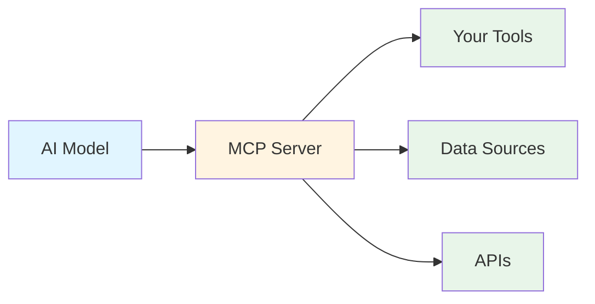
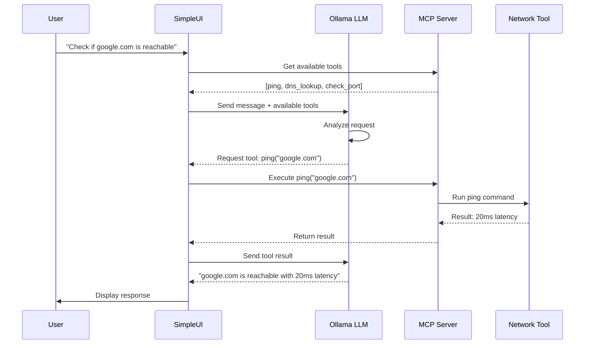
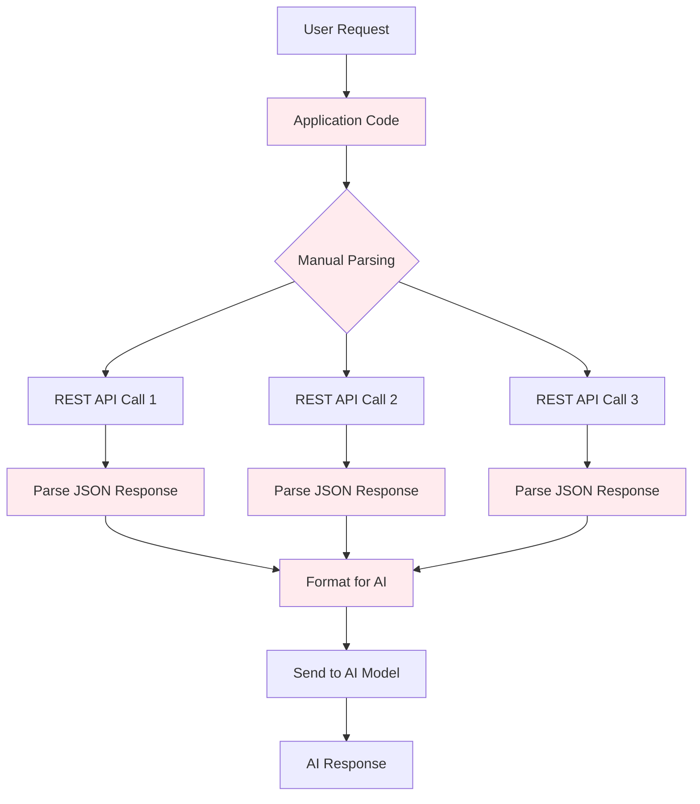
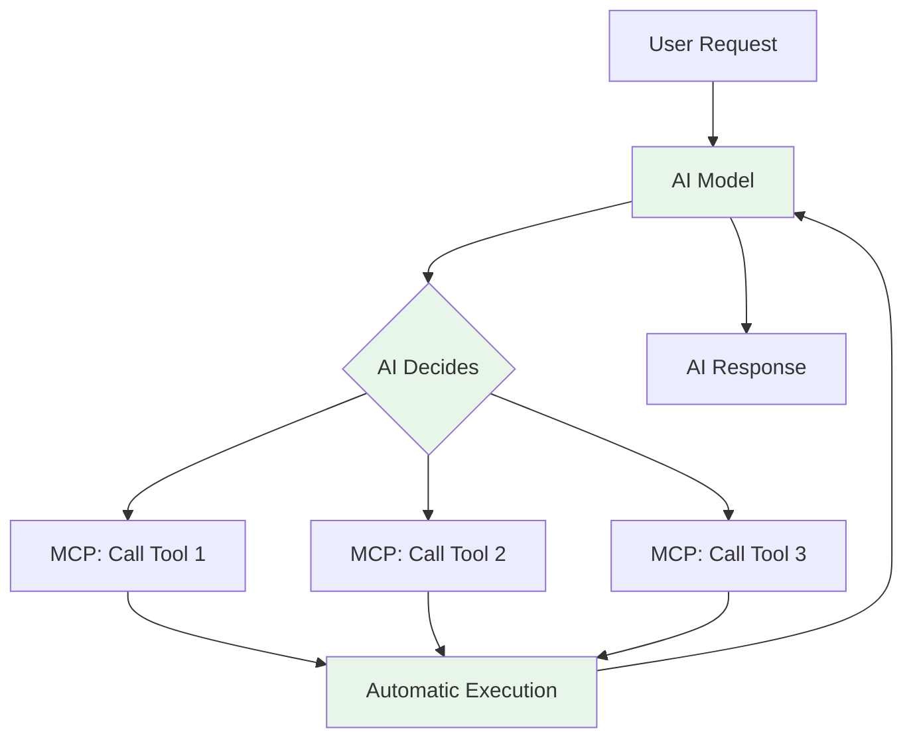
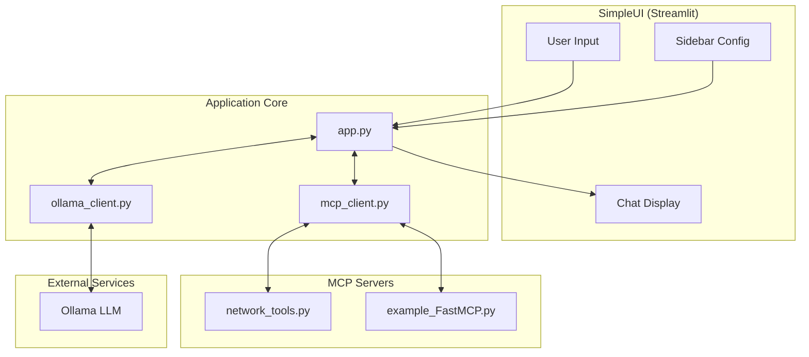

# MCP (Model Context Protocol) Learning Lab

A hands-on introduction to the Model Context Protocol (MCP) with practical network engineering tools and scenarios.

## Table of Contents
- [What You'll Learn](#what-youll-learn)
- [Prerequisites](#prerequisites)
- [Lab Overview](#lab-overview)
- [Understanding MCP](#understanding-mcp)
- [Understanding Ollama](#understanding-ollama)
- [MCP vs Traditional REST APIs](#mcp-vs-traditional-rest-apis)
- [Lab Setup](#lab-setup)
- [Building Your First MCP Tools](#building-your-first-mcp-tools)
- [Testing Your Tools](#testing-your-tools)
- [Next Steps](#next-steps)

## What You'll Learn

By completing this lab, you will:
- Understand what MCP is and why it matters for AI applications
- Learn how to run local LLMs using Ollama
- Build custom MCP tools using FastMCP (Python)
- Create network-focused tools (ping, DNS lookup, port checker)
- See practical advantages of MCP over traditional REST APIs

## Prerequisites

- **Linux environment** (WSL2, Ubuntu, or similar)
- **Basic command line** experience
- **Basic Python** knowledge (reading/understanding code)
- **Network engineering** background (understanding ping, DNS, ports)

## Lab Overview

This lab takes a progressive approach:

1. **Concepts & Setup** - Understand MCP and Ollama while setting up your environment
2. **First Tools** - Build simple network diagnostic tools with FastMCP
3. **Hands-on Testing** - Use your tools through the SimpleUI web interface
4. **Real-world Scenarios** - Apply your knowledge (separate labs in [scenarios/](scenarios/))
5. **Extension Challenges** - Advanced exercises (see [scenarios/](scenarios/))

---

## Understanding MCP

### What is MCP?

**Model Context Protocol (MCP)** is an open protocol created by Anthropic that standardizes how AI applications (like chatbots or agents) connect to external data sources and tools.

Think of MCP as a universal adapter that allows AI models to:
- **Access data sources** (databases, files, APIs)
- **Execute tools** (run commands, query systems, manipulate data)
- **Maintain context** across conversations

### Why MCP Matters



**Key Benefits:**
- **Standardization** - One protocol for all tool integrations
- **Security** - Controlled access to resources
- **Composability** - Mix and match tools from different sources
- **Discoverability** - AI models can discover available tools automatically

### MCP Architecture



**Components:**
1. **MCP Host** - The application using AI (SimpleUI in our lab)
2. **MCP Client** - Connects to and communicates with MCP servers
3. **MCP Server** - Exposes tools and resources to the AI
4. **Tools/Resources** - The actual functionality (your network tools)

---

## Understanding Ollama

### What is Ollama?

**Ollama** is a tool that makes it easy to run large language models (LLMs) locally on your machine.

**Why Use Ollama?**
- **Privacy** - Your data never leaves your machine
- **Cost** - No API fees, unlimited usage
- **Speed** - No network latency for API calls
- **Offline** - Works without internet connection
- **Control** - Choose your model, adjust parameters

**The Granite Models:**
- **granite4** - IBM's open-source LLM optimized for enterprise use
- **granite4:350m** - Smaller variant (350 million parameters) for low-resource systems
- Good balance of performance and resource usage for learning

---

## MCP vs Traditional REST APIs

### Traditional REST API Approach



**REST API Challenges:**
- You write code to parse user intent
- You manually decide which APIs to call
- You parse and format responses for the AI
- Each new tool requires integration code
- The AI can't discover or adapt to new tools

### MCP Approach



**MCP Benefits:**
- AI understands user intent automatically
- AI discovers and calls appropriate tools
- Results automatically flow back to AI
- Adding tools is just configuration
- AI can chain multiple tools intelligently

### Practical Example

**Scenario:** User asks "Is google.com down? Check both ping and DNS"

**With REST APIs:**
```python
# You write this code
def check_website(url):
    # Parse what user wants
    if "ping" in user_request:
        result1 = requests.get(f"http://api.example.com/ping/{url}")
        ping_data = result1.json()

    if "dns" in user_request:
        result2 = requests.get(f"http://api.example.com/dns/{url}")
        dns_data = result2.json()

    # Format for AI
    formatted = f"Ping: {ping_data}, DNS: {dns_data}"

    # Send to AI
    ai_response = call_ai_model(formatted)
```

**With MCP:**
```python
# You write this once
@mcp.tool()
async def ping(hostname: str) -> str:
    """Check if a host is reachable"""
    # Implementation
    return result

@mcp.tool()
async def dns_lookup(hostname: str) -> str:
    """Resolve DNS for a hostname"""
    # Implementation
    return result

# AI handles everything else automatically
# - Understands user wants both ping and DNS
# - Calls both tools
# - Interprets results
# - Responds to user
```

### Comparison Table

| Aspect | Traditional REST | MCP |
|--------|-----------------|-----|
| **Tool Discovery** | Hardcoded in application | AI discovers automatically |
| **Intent Parsing** | Manual string parsing | AI understands naturally |
| **Orchestration** | You write logic | AI chains tools intelligently |
| **Adding Tools** | Write integration code | Define tool schema |
| **Adaptability** | Fixed workflows | AI adapts to user needs |
| **Development Time** | High (lots of glue code) | Low (define tools, AI handles rest) |
| **Maintenance** | Update every integration | Update tool definitions |

---

## Lab Setup

### Step 1: Verify Environment

**What:** Ensure you have a working Linux environment.

**Why:** Ollama and the lab tools work best in Linux. WSL2 provides full Linux kernel compatibility on Windows.

```bash
# Verify your environment
uname -a
# Should show: Linux ...

# Check Python version
python3 --version
# Should be 3.10 or higher
```

### Step 2: Install Ollama

**What:** Ollama is the runtime that executes LLMs locally.

**Why:** We need a local AI model to demonstrate MCP tool integration without relying on external APIs.

```bash
# Install Ollama
curl -fsSL https://ollama.com/install.sh | sh

# Verify installation
ollama --version
```

**How it works:**
- Ollama runs as a background service
- Listens on `http://localhost:11434` by default
- Manages model downloads and execution
- Provides OpenAI-compatible API

### Step 3: Pull the Granite Model

**What:** Download the IBM Granite 4 language model.

**Why:** Granite4 is a capable open-source model good for learning and testing. The smaller variant works on modest hardware.

```bash
# For systems with 8GB+ RAM and decent CPU/GPU
ollama pull granite4

# For low-resource systems (4-8GB RAM)
ollama pull granite4:350m
```

**Verify the model:**
```bash
# List installed models
ollama list

# Test the model
ollama run granite4:350m

# Type a test message, then /bye to exit
```

### Step 4: Clone and Set Up the Lab

**What:** Get the lab files and install dependencies.

**Why:** The lab includes the SimpleUI web interface, example MCP servers, and the network tools you'll be working with.

```bash
# Navigate to the lab directory (or clone if needed)
cd /path/to/learning-labs/mcp

# Create a Python virtual environment
python3 -m venv .venv

# Activate the virtual environment
source .venv/bin/activate

# Install all dependencies
pip install -r requirements.txt
```

**What gets installed:**
- `streamlit` - Web UI framework
- `fastmcp` - Framework for building MCP servers
- `ollama` - Python client for Ollama API
- `dnspython` - DNS resolution library for network tools
- Other supporting libraries

### Step 5: Verify Full Setup

**What:** Quick checklist to ensure everything is working.

**Why:** Better to catch issues now before diving into the lab.

```bash
# 1. Check Ollama is running
curl http://localhost:11434/api/version
# Should return version info like: {"version":"0.x.x"}

# 2. Check Python environment
source .venv/bin/activate
python -c "import fastmcp; print('FastMCP ready!')"
python -c "import streamlit; print('Streamlit ready!')"

# 3. Test the network tools server directly
python network_tools.py
# Should show FastMCP banner - press Ctrl+C to stop
```

---

## Building Your First MCP Tools

The lab includes a pre-built `network_tools.py` file with three network diagnostic tools. Let's understand how it works.

### Understanding the Network Tools Server

Open `network_tools.py` and examine its structure:

```python
from fastmcp import FastMCP

# Initialize MCP server with a name
mcp = FastMCP("Network Tools")

@mcp.tool()
async def ping(hostname: str, count: int = 4) -> str:
    """
    Check if a host is reachable using ICMP ping.

    Args:
        hostname: The hostname or IP address to ping
        count: Number of ping packets to send (default: 4)

    Returns:
        Ping results including latency and packet loss
    """
    # Implementation here...
```

**Key Concepts:**

1. **FastMCP Initialization:**
   ```python
   mcp = FastMCP("Network Tools")
   ```
   - Creates an MCP server named "Network Tools"
   - This name appears when tools are discovered

2. **Tool Decorator:**
   ```python
   @mcp.tool()
   async def ping(hostname: str, count: int = 4) -> str:
   ```
   - `@mcp.tool()` registers the function as an MCP tool
   - Type hints help the AI understand parameters
   - Async functions allow non-blocking I/O operations

3. **Docstrings are Critical:**
   - The AI reads docstrings to understand what the tool does
   - Clear descriptions help the AI decide when to use each tool
   - Document all parameters and return values

### The Three Network Tools

| Tool | Purpose | Example Usage |
|------|---------|---------------|
| `ping` | Check host reachability | "Is google.com reachable?" |
| `dns_lookup` | Resolve DNS records | "What's the IP for github.com?" |
| `check_port` | Test TCP port status | "Is port 443 open on google.com?" |

### Adding Your Own Tool

To add a new tool, follow this pattern:

```python
@mcp.tool()
async def my_new_tool(required_param: str, optional_param: int = 10) -> str:
    """
    Brief description of what this tool does.

    Args:
        required_param: Description of this parameter
        optional_param: Description with default value noted

    Returns:
        Description of what gets returned
    """
    try:
        # Your implementation
        result = f"Processed {required_param}"
        return result
    except Exception as e:
        return f"Error: {str(e)}"
```

---

## Testing Your Tools

### Start the Web Interface

```bash
# Make sure you're in the lab directory with venv activated
cd /path/to/learning-labs/mcp
source .venv/bin/activate

# Start the Streamlit app
streamlit run app.py
```

Open your browser to: **http://localhost:8501**

### Understanding the Interface

The SimpleUI interface has:

1. **Sidebar (left)**
   - Model selection (granite4:350m)
   - MCP Server selection (Network Tools, Demo Tools)
   - Temperature slider
   - Connection status indicators

2. **Chat Area (center)**
   - Message input at bottom
   - Conversation history above
   - Tool calls shown inline

### Try Your Network Tools

**Example prompts to test:**

1. **Simple Ping:**
   ```
   Can you ping google.com and tell me if it's reachable?
   ```

2. **DNS Lookup:**
   ```
   What are the DNS A records for github.com?
   ```

3. **Port Check:**
   ```
   Is port 443 open on google.com?
   ```

4. **Combined Diagnostics:**
   ```
   Check if microsoft.com is up by pinging it and checking if port 80 is open
   ```

5. **Network Troubleshooting:**
   ```
   I can't reach example.com. Can you help diagnose the issue?
   Check DNS resolution, ping, and common ports (80, 443)
   ```

### What to Observe

- The AI understands your natural language request
- The AI automatically chooses which tools to use
- Tool calls are shown in the chat (you can see what's being executed)
- The AI can chain multiple tools together
- The AI interprets results and explains them
- You didn't write any orchestration code!

### Switching MCP Servers

In the sidebar, you can switch between:
- **Network Tools** - Your ping, DNS, and port check tools
- **Demo Tools** - Calculator, weather (mock), and web search (mock)

Try: "What's 25% of 840?" with Demo Tools selected.

---

## How It All Works Together



**Request Flow:**
1. User types a message in the UI
2. App.py gets available tools from the selected MCP server
3. Message + tools are sent to Ollama
4. Ollama decides if/which tools to call
5. Tool calls are executed via the MCP server
6. Results are sent back to Ollama
7. Ollama generates final response
8. Response is displayed to user

---

## Next Steps

Congratulations! You've successfully:
- Set up a local LLM environment with Ollama
- Created MCP tools using FastMCP
- Integrated tools with an AI interface
- Seen the power of MCP vs traditional approaches

### Continue Learning

1. **Add More Tools** - Extend `network_tools.py` with:
   - Traceroute
   - Whois lookup
   - HTTP status checker
   - SSL certificate checker

2. **Create a New MCP Server** - Build tools for:
   - Log file analysis
   - Configuration validation
   - System health monitoring

3. **Explore Scenarios** - Check the [scenarios/](scenarios/) directory for:
   - Network Troubleshooting Lab
   - Log Analysis Lab
   - Automated Documentation Lab

### Project Structure Reference

```
learning-labs/mcp/
├── app.py                 # Main Streamlit application
├── ollama_client.py       # Ollama API wrapper with tool support
├── mcp_client.py          # FastMCP client integration
├── network_tools.py       # Network diagnostic MCP server
├── example_FastMCP.py     # Demo tools MCP server
├── config.yaml            # Configuration for models and servers
├── requirements.txt       # Python dependencies
├── README.md              # This file
├── webui_framework_README.md  # SimpleUI framework documentation
└── tools/                 # Additional tool modules
```

### Additional Resources

- [MCP Documentation](https://modelcontextprotocol.io/)
- [FastMCP GitHub](https://github.com/jlowin/fastmcp)
- [Ollama Documentation](https://ollama.ai/docs)
- [Streamlit Documentation](https://docs.streamlit.io)

---

## Troubleshooting

### Ollama not responding

```bash
# Check if Ollama is running
curl http://localhost:11434/api/version

# Start Ollama if needed
ollama serve
```

### No models available

```bash
# List available models
ollama list

# Pull a model if needed
ollama pull granite4:350m
```

### MCP Server issues

```bash
# Test the server directly
python network_tools.py
# Should show FastMCP banner

# Check for import errors
python -c "import dns.resolver; print('dnspython OK')"
```

### Tools not appearing in UI

1. Ensure the correct MCP Server is selected in the sidebar
2. Check the Status section shows "FastMCP: Available"
3. Restart the Streamlit app after config changes

### Port conflicts

- Streamlit default: 8501 (change with `--server.port`)
- Ollama default: 11434

---

**Happy Learning!**

For questions or issues, check the troubleshooting section above or consult the additional resources.
