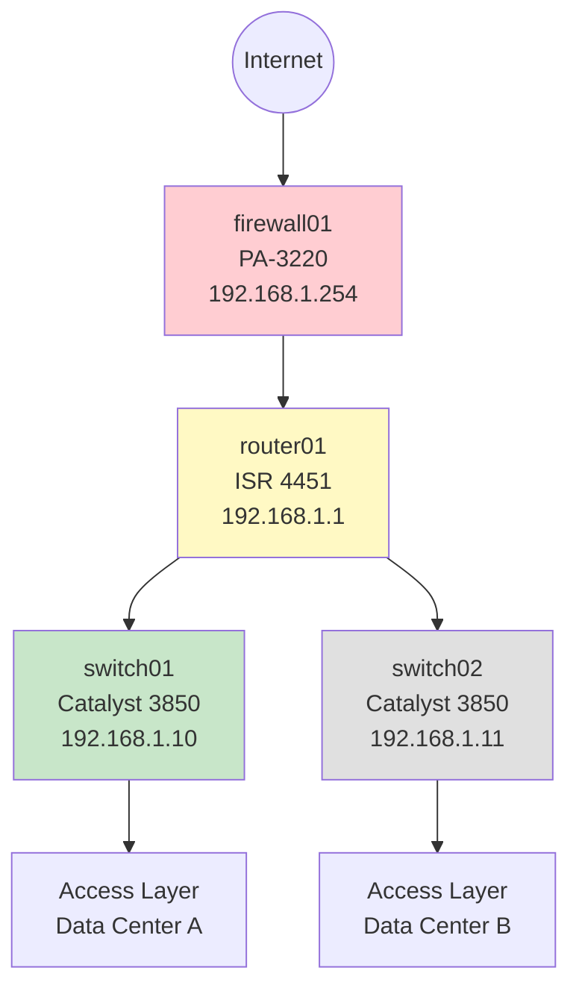

# Real-World Scenario: Automated Network Documentation

## Scenario Overview

Network documentation is critical but time-consuming to maintain. Using MCP tools, you can automatically gather network information and let AI generate comprehensive, up-to-date documentation.

**Prerequisites:** Complete the main [MCP Lab](../README.md) setup first.

---

## Learning Objectives

- Create MCP tools for gathering network information
- Use AI to generate structured documentation
- Maintain living documentation with automated updates
- Generate various documentation formats

---

## The Challenge

Network teams struggle with:
- Outdated documentation
- Inconsistent documentation formats
- Time-intensive manual documentation
- Difficulty keeping docs current

**MCP Solution:** Tools gather data automatically, AI formats it into clear documentation.

---

## Part 1: Create Network Inventory Tool

Let's build a tool that can retrieve network device information.

### Add Network Inventory Tool

Add this to your [~/mcp-lab/tools/network_tools.py](../tools/network_tools.py):

```python
import json
from datetime import datetime

@mcp.tool()
def get_device_inventory(format: str = "json") -> str:
    """
    Get current network device inventory.

    Args:
        format: Output format - 'json', 'text', or 'markdown' (default: json)

    Returns:
        Network device inventory in requested format
    """
    # This is simulated inventory - in production, this would query
    # your network management system, SNMP, or device APIs

    inventory = {
        "generated": datetime.now().isoformat(),
        "devices": [
            {
                "hostname": "router01",
                "type": "router",
                "model": "Cisco ISR 4451",
                "ip": "192.168.1.1",
                "location": "Data Center A - Rack 12",
                "status": "active",
                "uptime_days": 145,
                "os_version": "IOS XE 17.9.1",
                "interfaces": [
                    {"name": "GigabitEthernet0/0", "status": "up", "speed": "1000Mbps"},
                    {"name": "GigabitEthernet0/1", "status": "up", "speed": "1000Mbps"},
                    {"name": "GigabitEthernet0/2", "status": "down", "speed": "1000Mbps"}
                ],
                "bgp_neighbors": ["192.168.1.2", "10.0.0.1"],
                "role": "Edge Router"
            },
            {
                "hostname": "switch01",
                "type": "switch",
                "model": "Cisco Catalyst 3850",
                "ip": "192.168.1.10",
                "location": "Data Center A - Rack 15",
                "status": "active",
                "uptime_days": 234,
                "os_version": "IOS 16.12.5",
                "interfaces": [
                    {"name": f"FastEthernet0/{i}", "status": "up" if i < 20 else "down", "speed": "1000Mbps"}
                    for i in range(1, 25)
                ],
                "vlans": [10, 20, 30, 40],
                "role": "Access Switch"
            },
            {
                "hostname": "firewall01",
                "type": "firewall",
                "model": "Palo Alto PA-3220",
                "ip": "192.168.1.254",
                "location": "Data Center A - Rack 10",
                "status": "active",
                "uptime_days": 89,
                "os_version": "PAN-OS 10.2.3",
                "throughput_mbps": 4500,
                "active_sessions": 125000,
                "security_rules": 234,
                "role": "Perimeter Firewall"
            },
            {
                "hostname": "switch02",
                "type": "switch",
                "model": "Cisco Catalyst 3850",
                "ip": "192.168.1.11",
                "location": "Data Center B - Rack 08",
                "status": "maintenance",
                "uptime_days": 5,
                "os_version": "IOS 16.12.5",
                "interfaces": [
                    {"name": f"FastEthernet0/{i}", "status": "down", "speed": "1000Mbps"}
                    for i in range(1, 25)
                ],
                "vlans": [10, 20, 30, 40],
                "role": "Access Switch"
            }
        ],
        "summary": {
            "total_devices": 4,
            "active": 3,
            "maintenance": 1,
            "total_interfaces": 54,
            "up_interfaces": 22
        }
    }

    if format == "json":
        return json.dumps(inventory, indent=2)

    elif format == "text":
        output = [f"Network Inventory - Generated: {inventory['generated']}\n"]
        output.append("=" * 70)

        for device in inventory["devices"]:
            output.append(f"\nDevice: {device['hostname']}")
            output.append(f"  Type: {device['type'].title()}")
            output.append(f"  Model: {device['model']}")
            output.append(f"  IP: {device['ip']}")
            output.append(f"  Location: {device['location']}")
            output.append(f"  Status: {device['status'].upper()}")
            output.append(f"  Role: {device['role']}")

        output.append("\n" + "=" * 70)
        output.append(f"Summary: {inventory['summary']['active']} active devices, "
                     f"{inventory['summary']['up_interfaces']} interfaces up")

        return "\n".join(output)

    elif format == "markdown":
        output = [f"# Network Device Inventory\n"]
        output.append(f"*Generated: {inventory['generated']}*\n")
        output.append("## Devices\n")
        output.append("| Hostname | Type | Model | IP | Status | Role |")
        output.append("|----------|------|-------|--------|--------|------|")

        for device in inventory["devices"]:
            output.append(f"| {device['hostname']} | {device['type']} | "
                         f"{device['model']} | {device['ip']} | "
                         f"{device['status']} | {device['role']} |")

        output.append(f"\n## Summary\n")
        output.append(f"- **Total Devices:** {inventory['summary']['total_devices']}")
        output.append(f"- **Active:** {inventory['summary']['active']}")
        output.append(f"- **In Maintenance:** {inventory['summary']['maintenance']}")
        output.append(f"- **Total Interfaces:** {inventory['summary']['total_interfaces']}")
        output.append(f"- **Active Interfaces:** {inventory['summary']['up_interfaces']}")

        return "\n".join(output)

    else:
        return f"✗ Invalid format: {format}. Use 'json', 'text', or 'markdown'"
```

---

## Part 2: Generate Documentation

Now use your AI assistant to create various types of documentation.

### Exercise 1: Quick Overview

**Prompt:**
```
Get the network device inventory and give me a quick overview of our network infrastructure.
```

**Expected AI behavior:**
- Calls `get_device_inventory`
- Summarizes key information
- Highlights any concerns (devices in maintenance)
- Provides high-level statistics

### Exercise 2: Detailed Device Documentation

**Prompt:**
```
Generate detailed documentation for each network device in our inventory.
For each device, include:
- Purpose and role
- Hardware specifications
- Network configuration
- Current status
- Location information

Format it as a professional network documentation page.
```

**Expected AI behavior:**
- Retrieves inventory
- Creates structured documentation for each device
- Adds context and explanations
- Formats clearly with sections

### Exercise 3: Network Diagram Documentation

**Prompt:**
```
Based on our device inventory, create a network topology diagram using Mermaid.
Show how devices connect and their roles.
```

**Expected AI behavior:**
- Analyzes device roles and types
- Creates Mermaid diagram
- Shows logical topology
- Labels connections and roles

**Example output:**


### Exercise 4: Status Report

**Prompt:**
```
Create a network health status report. Include:
- Overall health score
- Devices requiring attention
- Uptime statistics
- Any devices in non-operational state
- Recommendations
```

### Exercise 5: Maintenance Schedule

**Prompt:**
```
Based on device uptimes and OS versions, create a maintenance schedule recommendation.
Identify which devices need firmware updates or are due for maintenance windows.
```

### Exercise 6: Capacity Report

**Prompt:**
```
Generate a capacity report showing:
- Interface utilization (active vs total)
- Devices under/over utilized
- Growth recommendations
- Potential bottlenecks
```

---

## Part 3: Compliance Documentation

### Exercise 7: Security Audit Documentation

**Prompt:**
```
Create a security compliance document for our network infrastructure.
Include:
- Firewall configurations and rules count
- Device access controls
- OS versions and patch status
- Security posture assessment
```

### Exercise 8: Change Management Record

**Prompt:**
```
Document the current state of our network as a baseline for change management.
This will be used to compare against future states to track changes.
Include all relevant configuration details.
```

---

## Part 4: Automated Reports

### Create Report Templates

**Prompt:**
```
Create a weekly network infrastructure report template that I can reuse.
It should include:
1. Executive Summary
2. Device Status Overview
3. Performance Metrics
4. Issues and Concerns
5. Planned Maintenance
6. Action Items
```

### Generate Comparison Reports

**Prompt:**
```
Compare our current inventory against best practices:
- Are devices running current OS versions?
- Are there single points of failure?
- Is redundancy adequate?
- Are devices past end-of-life?
```

---

## Part 5: Interactive Documentation

### Create Troubleshooting Guides

**Prompt:**
```
For each device in our inventory, create a troubleshooting quick reference guide.
Include:
- How to check if device is healthy
- Common issues and solutions
- Who to contact for problems
- Escalation procedures
```

### Build Runbooks

**Prompt:**
```
Create an operational runbook for router01. Include:
- Normal operating parameters
- How to verify it's functioning correctly
- Step-by-step troubleshooting procedure
- Rollback procedures for changes
- Emergency contacts
```

---

## Part 6: Advanced Documentation Features

### Multi-Format Export

**Prompt:**
```
Generate our network documentation in three formats:
1. Markdown for our wiki
2. Simple text for email reports
3. Structured format for our ticketing system
```

### Version Control Integration

**Prompt:**
```
Create a git-friendly documentation structure for our network inventory.
Format it so we can track changes over time in version control.
Include a changelog format.
```

### Stakeholder-Specific Views

**Prompt:**
```
Create three versions of our network documentation:
1. Executive summary (non-technical, high-level)
2. Operations team version (detailed technical info)
3. Security team version (focus on security posture)
```

---

## Real-World Integration

### Integration with Monitoring Systems

**Enhanced Tool Example:**

```python
@mcp.tool()
def get_device_metrics(hostname: str, metric_type: str = "all") -> str:
    """
    Get real-time metrics for a network device.

    Args:
        hostname: Device hostname
        metric_type: Type of metrics - 'cpu', 'memory', 'interfaces', 'all'

    Returns:
        Current device metrics
    """
    # In production, this would query your monitoring system
    # Nagios, PRTG, SolarWinds, etc.
    pass
```

**Usage:**
```
Get current CPU and memory metrics for all devices and update
our performance documentation.
```

### Integration with Configuration Management

```python
@mcp.tool()
def get_device_config(hostname: str, section: str = "all") -> str:
    """
    Retrieve device configuration.

    Args:
        hostname: Device hostname
        section: Config section - 'interfaces', 'routing', 'acl', 'all'

    Returns:
        Device configuration
    """
    # Query device or config management system
    pass
```

**Usage:**
```
Document the routing configuration for router01 with
explanations of each route's purpose.
```

---

## Documentation Automation Pipeline

### Daily Documentation Updates

Create a daily routine:

1. **Morning Health Check:**
```
Review network inventory and update status documentation.
Flag any changes from yesterday.
```

2. **Weekly Summary:**
```
Generate weekly infrastructure report including:
- Device status changes
- New devices or decommissions
- Performance trends
- Upcoming maintenance
```

3. **Monthly Audit:**
```
Full documentation audit:
- Verify all devices documented
- Check for outdated information
- Update diagrams
- Review and update runbooks
```

---

## Key Benefits

### Traditional Documentation Process

1. Manually SSH to each device
2. Run show commands
3. Copy output to document
4. Format and organize
5. Add explanations
6. **Time: Hours to days**

### MCP-Powered Process

1. Ask AI to generate documentation
2. **Time: Minutes**

### What You Gain

- **Always current** - Generate docs on-demand from live data
- **Consistent format** - AI maintains structure
- **Multiple formats** - Same data, different presentations
- **Contextual** - AI adds explanations and insights
- **Searchable** - AI can answer questions about docs
- **Version trackable** - Easy to see what changed

---

## Best Practices

### 1. Automate Data Collection
Create tools that pull from:
- Device APIs
- Monitoring systems
- Configuration management databases
- IPAM (IP Address Management)
- Asset management systems

### 2. Keep Source Data Structured
Use JSON or structured formats so AI can:
- Parse easily
- Generate multiple views
- Compare over time

### 3. Regular Updates
Schedule documentation generation:
- Daily: Status reports
- Weekly: Summary reports
- Monthly: Full documentation review

### 4. Version Control
Store generated documentation in Git:
- Track changes over time
- See what changed and when
- Collaborate on improvements

### 5. Validate Generated Docs
AI is powerful but:
- Review critical documentation
- Verify technical accuracy
- Ensure compliance requirements met

---

## Extension Ideas

### Add More Data Sources
- SNMP polling
- NetFlow analysis
- Syslog aggregation
- API integration with network vendors

### Enhance Output Formats
- HTML with CSS styling
- PDF reports
- PowerPoint presentations
- Wiki auto-updates

### Intelligent Documentation
- Detect configuration drift
- Flag non-compliant configs
- Suggest optimizations
- Identify security risks

### Automated Diagramming
- Generate topology from LLDP/CDP
- Create physical rack diagrams
- Build logical network maps
- Show traffic flows

---

## Sample Complete Documentation

Here's what AI can generate from your inventory:

**Prompt:**
```
Generate a complete network infrastructure documentation package for our organization.
Include overview, detailed device information, topology diagram, status report,
and maintenance recommendations. Format professionally.
```

**AI generates:** A comprehensive, multi-section document with:
- Executive summary
- Network topology diagram (Mermaid)
- Device inventory table
- Detailed device profiles
- Status and health report
- Capacity analysis
- Security posture
- Maintenance schedule
- Appendices with technical details

---

## Next Steps

- Try combining with [Log Analysis Lab](log-analysis.md) to include log insights in docs
- Challenge yourself with [Extension Challenges](challenges.md)
- Build integration with your actual network management tools

---

**Questions or Issues?** See the [Troubleshooting Guide](../TROUBLESHOOTING.md)
