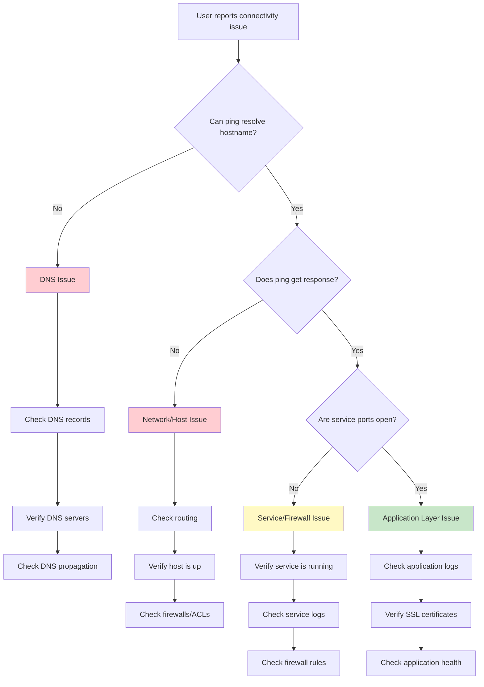

# Real-World Scenario: Network Troubleshooting

## Scenario Overview

You're a network engineer receiving reports that users can't access the company's customer portal at `portal.example.com`. You need to diagnose the issue quickly using your MCP-enabled AI assistant with network tools.

**Prerequisites:** Complete the main [MCP Lab](../README.md) setup first.

---

## Learning Objectives

- Use AI to guide systematic network troubleshooting
- Leverage multiple MCP tools in sequence
- Interpret results in context
- Document findings efficiently

---

## The Problem

**Ticket #4782: Users unable to access customer portal**

```
From: Help Desk
Priority: High
Description: Multiple users reporting they cannot access portal.example.com
Error: "This site can't be reached" in browser
Started: ~30 minutes ago
```

---

## Troubleshooting Workflow

### Step 1: Initial Assessment

Ask your AI assistant to help diagnose the issue:

**Prompt:**
```
I'm troubleshooting an issue where users can't access portal.example.com.
Can you help me systematically diagnose this? Start with basic connectivity checks.
```

**What to observe:**
- The AI should suggest a logical troubleshooting sequence
- It should use `ping` first to check basic connectivity
- It should interpret the results

### Step 2: DNS Investigation

If the ping shows hostname resolution issues:

**Prompt:**
```
The hostname isn't resolving. Can you check DNS for portal.example.com?
Also check what the DNS records show for our main domain example.com
```

**Expected AI behavior:**
- Uses `dns_lookup` tool for both domains
- Compares results
- Identifies if it's a DNS configuration issue

### Step 3: Service Availability

If the host is reachable but service is down:

**Prompt:**
```
The server is up but users can't access the web portal.
Check if the web services are listening on ports 80 and 443.
```

**Expected AI behavior:**
- Uses `check_port` for both HTTP (80) and HTTPS (443)
- Identifies which services are available
- Suggests next steps based on findings

### Step 4: Compare with Working Service

**Prompt:**
```
For comparison, can you check if our main website www.example.com is
responding normally? Check DNS, ping, and web ports.
```

**Expected AI behavior:**
- Runs all three checks in sequence
- Compares results with the problematic service
- Helps isolate whether it's a systemic issue or specific to one service

### Step 5: Documentation

**Prompt:**
```
Can you summarize your findings in a format I can send to the team?
Include what you checked, what you found, and what the likely issue is.
```

**Expected AI behavior:**
- Synthesizes all test results
- Provides clear summary
- Suggests root cause
- Recommends next steps

---

## Practice Scenarios

Try these different failure scenarios to build your troubleshooting skills:

### Scenario A: DNS Failure
```
Test with: portal.test-domain-doesnt-exist.com
Expected: DNS lookup fails, ping fails
Root cause: DNS misconfiguration
```

### Scenario B: Host Down
```
Test with: 192.0.2.1 (documentation IP, should be unreachable)
Expected: Ping timeout, all ports closed
Root cause: Server is down or unreachable
```

### Scenario C: Service Port Closed
```
Test with: google.com port 22
Expected: Host reachable (ping works), but port closed
Root cause: Service not running or firewall blocking
```

### Scenario D: Partial Service Failure
```
Test with: github.com
Check ports: 80, 443, 22 (SSH), 9418 (git)
Observe: HTTP/HTTPS work, but some services may be filtered
Root cause: Selective service availability (normal)
```

---

## Troubleshooting Decision Tree



---

## Advanced Exercises

### Exercise 1: Multi-Site Comparison

Check multiple sites simultaneously and identify patterns:

**Prompt:**
```
I need to check the health of multiple services:
- web1.example.com (HTTP/HTTPS)
- web2.example.com (HTTP/HTTPS)
- api.example.com (HTTPS only, port 443)
- database.example.com (custom port 5432)

Check ping and relevant ports for each. Identify any issues.
```

### Exercise 2: Latency Analysis

Compare latency across different hosts:

**Prompt:**
```
Ping these hosts and compare latencies:
- google.com
- cloudflare.com
- amazon.com
- microsoft.com

Which has the best connectivity from our location?
```

### Exercise 3: DNS Configuration Audit

**Prompt:**
```
For github.com, check:
- A records
- AAAA records (IPv6)
- MX records (mail)
- TXT records

Document the complete DNS configuration.
```

---

## Real-World Tips

### 1. Always Start Simple
- Ping first (Layer 3)
- Then DNS (Application layer)
- Then specific ports (Services)

### 2. Compare with Known-Good
- Always have a baseline
- Test a working service for comparison
- Helps isolate if it's systemic vs. specific

### 3. Document as You Go
- Use the AI to help document findings
- Timestamps matter
- Save the conversation as your incident log

### 4. Know Your Tools' Limitations
- Ping can be blocked by firewalls
- Port checks only show if port is listening
- DNS may be cached locally

### 5. Escalation Points
When to escalate beyond network tools:
- Network layer checks out, but application fails → App team
- All network checks fail → Infrastructure/ISP issue
- Intermittent issues → Need packet capture/monitoring

---

## Key Takeaways

After completing this lab, you should understand:

1. **Systematic approach** - Follow logical troubleshooting steps
2. **Tool selection** - The AI chooses appropriate tools automatically
3. **Result interpretation** - The AI helps make sense of technical output
4. **Efficient documentation** - Generate reports from troubleshooting sessions
5. **AI collaboration** - The AI is a troubleshooting partner, not just a tool executor

---

## Next Steps

- Try [Log Analysis Lab](log-analysis.md) - Analyze network device logs
- Try [Automated Documentation Lab](automated-docs.md) - Generate network documentation
- Challenge yourself with [Extension Challenges](challenges.md)

---

**Questions or Issues?** See the [Troubleshooting Guide](../TROUBLESHOOTING.md)
