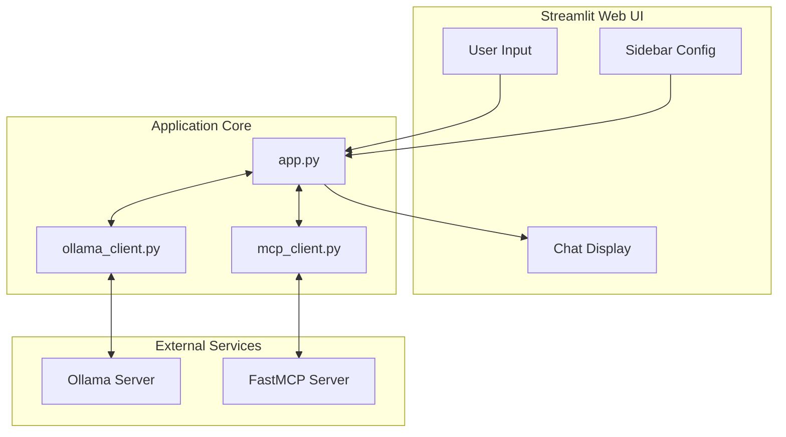
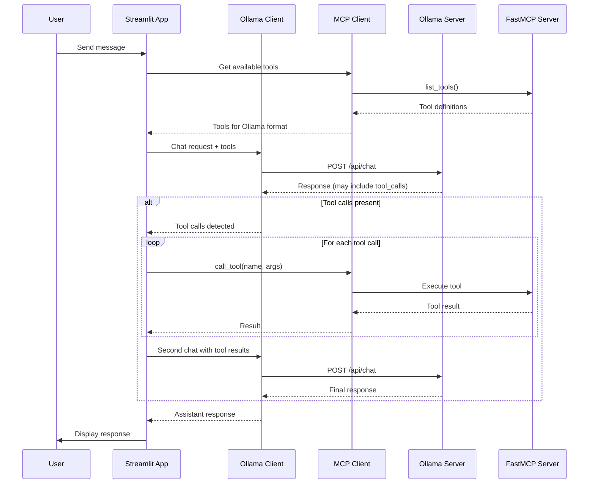
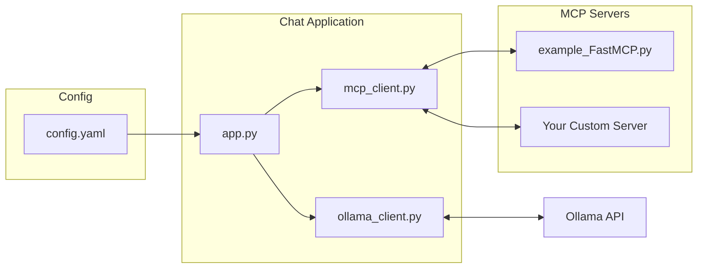
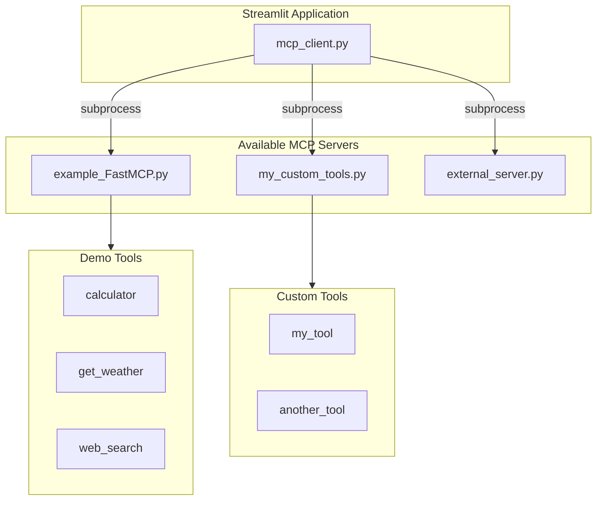

# Ollama + FastMCP Chat Interface

A web-based chat interface that connects local Ollama models with FastMCP servers, enabling LLM tool-calling capabilities through an intuitive Streamlit UI.

## Architecture Overview



## Request Flow



## Component Interaction



## Features

- Chat with local Ollama models through a clean web interface
- Tool calling support via FastMCP servers
- Multiple MCP server support with easy switching
- Persistent chat history during session
- Model selection and temperature control
- Real-time connection status monitoring
- Clean, responsive Streamlit UI

## Prerequisites

- Python 3.10 or higher
- Ollama installed and running ([Install Ollama](https://ollama.com/download))
- At least one Ollama model with tool support (e.g., `granite4:350m`, `llama3.2`, `mistral`)

## Quick Start

### 1. Install Ollama and Pull a Model

```bash
# Install Ollama (if not already installed)
curl -fsSL https://ollama.com/install.sh | sh

# Start Ollama service
ollama serve

# In another terminal, pull a model with tool support
ollama pull granite4:350m
```

### 2. Clone and Setup Project

```bash
# Clone the repository
git clone <repo-url>
cd Simple_MCPUI

# Create virtual environment
python -m venv .venv
source .venv/bin/activate  # On Windows: .venv\Scripts\activate

# Install dependencies
pip install -r requirements.txt
```

### 3. Run the Application

```bash
streamlit run app.py
```

The MCP server is started automatically via subprocess when needed - no separate terminal required.

### 4. Access the Application

Open your browser and navigate to: `http://localhost:8501`

## Project Structure

```
Simple_MCPUI/
├── app.py                 # Main Streamlit application
├── ollama_client.py       # Ollama API wrapper with tool support
├── mcp_client.py          # FastMCP client integration
├── example_FastMCP.py     # Example FastMCP server with sample tools
├── config.yaml            # Configuration for models and servers
├── requirements.txt       # Python dependencies
├── pyproject.toml         # Project metadata and build config
└── .env.example           # Environment variables template
```

## Configuration

### config.yaml

```yaml
ollama:
  host: "http://localhost:11434"
  models:
    - granite4:350m
    - llama3.2:1b

mcp:
  servers:
    - name: "Demo Tools"
      script: "example_FastMCP.py"
      description: "Calculator, weather, and web search tools"
  default_server: "Demo Tools"
  timeout: 30

chat:
  default_model: "granite4:350m"
  max_tokens: 2048
  temperature: 0.7
```

## Adding Custom MCP Servers

This application supports multiple FastMCP servers that can be switched via the UI. Follow these steps to add your own:

### Step 1: Create Your MCP Server

Create a new Python file with your tools using FastMCP:

```python
# my_custom_tools.py
from fastmcp import FastMCP

mcp = FastMCP("My Custom Tools")

@mcp.tool()
async def my_tool(param1: str, param2: int = 10) -> str:
    """
    Description of what the tool does.

    Args:
        param1: Description of param1
        param2: Description of param2 (default: 10)

    Returns:
        Description of return value
    """
    # Your implementation here
    result = f"Processed {param1} with value {param2}"
    return result

@mcp.tool()
async def another_tool(query: str) -> str:
    """Search for something."""
    # Implementation
    return f"Results for: {query}"

if __name__ == "__main__":
    mcp.run()
```

### Step 2: Register in config.yaml

Add your server to the `mcp.servers` list:

```yaml
mcp:
  servers:
    - name: "Demo Tools"
      script: "example_FastMCP.py"
      description: "Calculator, weather, and web search tools"

    - name: "My Custom Tools"
      script: "my_custom_tools.py"
      description: "Description of your custom tools"

    # External servers (absolute paths)
    - name: "External API Tools"
      script: "/path/to/external/api_tools.py"
      description: "External API integrations"

  default_server: "Demo Tools"
```

### Step 3: Restart the Application

```bash
# If running, stop with Ctrl+C then restart
streamlit run app.py
```

Your new server will appear in the MCP Server dropdown in the sidebar.

### MCP Server Architecture



### Tool Definition Best Practices

1. **Clear Descriptions**: Write detailed docstrings - the LLM uses these to decide when to call your tool
2. **Type Hints**: Always include type hints for parameters and return values
3. **Default Values**: Provide sensible defaults where appropriate
4. **Error Handling**: Return informative error messages instead of raising exceptions
5. **Async Functions**: Use `async def` for tools that perform I/O operations

```python
@mcp.tool()
async def well_documented_tool(
    required_param: str,
    optional_param: int = 100,
    flag: bool = False
) -> str:
    """
    A well-documented tool that does something useful.

    This tool demonstrates best practices for MCP tool definitions.
    The LLM will read this description to understand when to use this tool.

    Args:
        required_param: A required string parameter (e.g., "example value")
        optional_param: An optional integer with default 100
        flag: Enable special processing mode

    Returns:
        A formatted string with the processing results

    Examples:
        - "Process data X" -> calls with required_param="X"
        - "Process Y with limit 50" -> calls with required_param="Y", optional_param=50
    """
    try:
        # Implementation
        result = f"Processed: {required_param}"
        if flag:
            result += " (special mode)"
        return result
    except Exception as e:
        return f"Error processing request: {str(e)}"
```

## Usage Examples

### Basic Chat

```
User: Tell me about artificial intelligence
Assistant: [Responds with information about AI]
```

### With Tool Calling

```
User: What's 25% of 840?
Assistant: [Uses calculator tool]
25% of 840 is 210.
```

### Multiple Tools

```
User: What's the weather in Seattle and calculate 123 * 456
Assistant: [Uses get_weather and calculator tools]
The weather in Seattle is 52°F, Partly Cloudy.
123 * 456 = 56,088
```

## Troubleshooting

### Ollama not responding

- Ensure Ollama service is running: `ollama serve`
- Check accessibility: `curl http://localhost:11434/api/tags`
- Verify models are available: `ollama list`

### No models available

- Pull a model: `ollama pull granite4:350m`
- Update `config.yaml` with your model name

### MCP Server issues

- Check the sidebar "Status" section shows FastMCP as available
- Verify your server script has no syntax errors: `python my_server.py`
- Check server logs in the terminal for error messages

### Tools not appearing

- Ensure tools have the `@mcp.tool()` decorator
- Verify docstrings are present (required for tool descriptions)
- Restart the Streamlit app after adding new tools

### Port conflicts

- Streamlit default: 8501 (change with `--server.port`)
- Ollama default: 11434

## Development

### Running with Different Models

```bash
# Pull additional models
ollama pull llama3.2:1b
ollama pull mistral

# Update config.yaml models list, then restart
```

### Custom Streamlit Port

```bash
streamlit run app.py --server.port 8502
```

### Testing Your MCP Server

```bash
# Test server directly
python my_custom_tools.py

# Or use fastmcp CLI if available
fastmcp dev my_custom_tools.py
```

## Limitations

- Single user session (no multi-user support)
- No persistent chat history (resets on refresh)
- Mock implementations for weather and web search in example server
- Requires models with tool-calling support

## Resources

- [Ollama Documentation](https://github.com/ollama/ollama)
- [FastMCP Documentation](https://github.com/jlowin/fastmcp)
- [Streamlit Documentation](https://docs.streamlit.io)
- [Model Context Protocol](https://modelcontextprotocol.io/)

## License

MIT License
